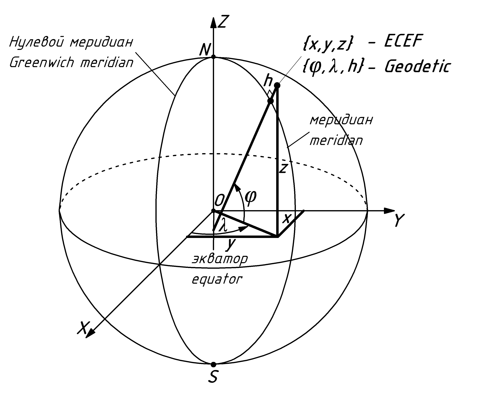
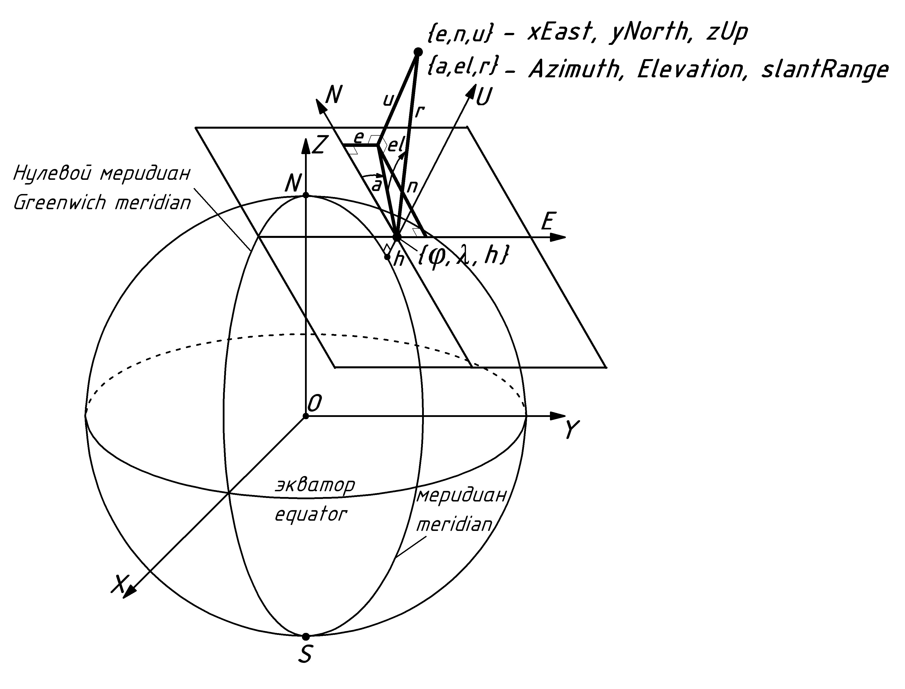
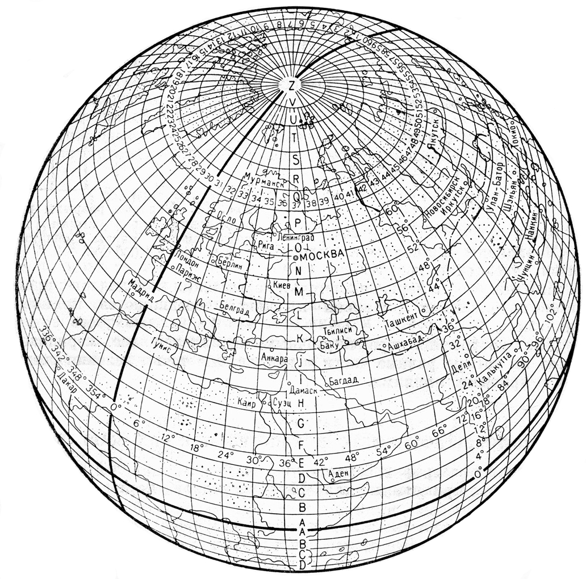

# Geodetic calculator/Геодезический калькулятор #

## 1. Brief / Обзор ##

***

* Sovling direct and inverse geodetic tasks on ellipsoid (using Vincenty formulas) / 
Решение и обратной геодезической задачи на эллипсоиде (по формулам Винсента)

<p style="text-align: center;">
<span style="text-decoration: underline">
Fig.1 - Geodetic problems/Рис.1 - Геодезические задачи
</span>
</p>
<!--<div style="text-align: center;">

</div>-->
<center></center>
<?\image html directinverse.jpg width=500px?>
<?\image latex directinverse.jpg?>

***

* Conversion between following coordinate systems/Перевод между следующими системами коориднат:
    - Geodetic <--> ECEF (Earth Centered Earth Fixed)/Геодезические в глобальные декартовые геоцентрические;
    - Geodetic <--> ENU (xEast, yNorth, zUp)/Геодезические в местные декартовые;
    - Geodetic <--> AER (Azimuth, Elevation, slantRange)/Геодезические в местные cферические;
    - ECEF <--> ENU/Глобальные декартовые геоцентрические в местные декартовые;
    - ECEF <--> AER/Глобальные декартовые геоцентрические в местные cферические;
    - ENU <--> AER/Местные декартовые в местные cферические;

<!--<center>Fig.2 - Geodetic to ECEF/Рис.2 - Геодезические координаты в глобальные декартовые</center>-->
<p style="text-align: center;">
<span style="text-decoration: underline">
Fig.2 - Geodetic to ECEF/Рис.2 - Геодезические координаты в глобальные декартовые
</span>
</p>
<!--<div style="text-align: center;">

</div>-->
<center></center>
<?\image html geoecef.jpg width=650px?>
<?\image latex geoecef.jpg?>

<!--<center>Fig.3 - ENU to AER/Рис.3 - местные декартовые координаты в местные сферические</center>-->
<p style="text-align: center;">
<span style="text-decoration: underline">
Fig.3 - ENU to AER/Рис.3 - местные декартовые координаты в местные сферические
</span>
</p>
<!--<div style="text-align: center;">

</div>-->
<center></center>
<?\image html enuaer.jpg width=770px?>
<?\image latex enuaer.jpg?>

***

* 7-parameters transformation between different ECEFs (Bursa-Wolf)/7-параметрическое преобразование Бурса-Вольфа между
глобальными декартовыми геоцентрическими координатами:
    - SK-42 <--> WGS-84
    - SK-42 <--> PZ-90.11
    - SK-95 <--> PZ-90.11
    - GSK-2011 <--> PZ-90.11
    - PZ-90.02 <--> PZ-90.11
    - PZ-90 <--> PZ-90.11
    - WGS-84 <--> PZ-90.11
    - PZ-90.11 <--> ITRF-2008

* Conversion between Lat-Lon on Krassowsky1942 ellipsoid and X-Y Gauss-Kruger SK42/Перевод между широтой/долготой на эллипсоиде
Красовского и плоскими координатами Гаусса-Крюгера СК42

<!--<center>Fig.4 - SK-42 coordinate system/Рис.4 - листы СК-42</center>-->
<p style="text-align: center;">
<span style="text-decoration: underline">
Fig.4 - SK-42 coordinate system/Рис.4 - листы СК-42
</span>
</p>
<!--<div style="text-align: center;">

</div>-->
<center></center>
<?\image html sk42.jpg width=650px?>
<?\image latex sk42.jpg?>

## 2. References / Ссылки ##

* https://epsg.io/
* GOST/ГОСТ 32453-2017
* Vincenty, Thaddeus (April 1975a). "Direct and Inverse Solutions of Geodesics on the Ellipsoid with
application of nested equations". Survey Review. XXIII (176): 88–93.
* Морозов В.П. Курс сфероидической геодезии. Изд. 2, перераб и доп. М.,Недра, 1979, 296 с., стр 97-100
* Olson, D. K. (1996). Converting Earth-Centered, Earth-Fixed Coordinates to Geodetic Coordinates. IEEE Transactions on 
Aerospace and Electronic Systems, 32(1), 473–476. https://doi.org/10.1109/7.481290

## 3. Dependencies / Зависимости ##
<br /> Boost for console commands parsing, testing / Boost для ввода команд с консоли, тестирования.

## 4. Documentation / Документация ##

Including doxygen html and latex doc generation while building in release mode/doxygen и latex документация 
автоматически создается при релизной сборке.

## 5. Build / Сборка ##

Possible Linux-Ubuntu command is/Сборка под Linux-Ubuntu производится командой:
```
mkdir build && cd build && cmake .. && make && ctest && cpack
```
